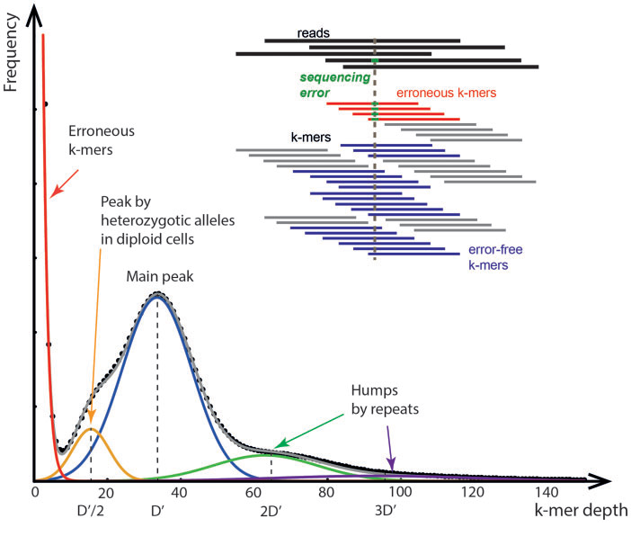
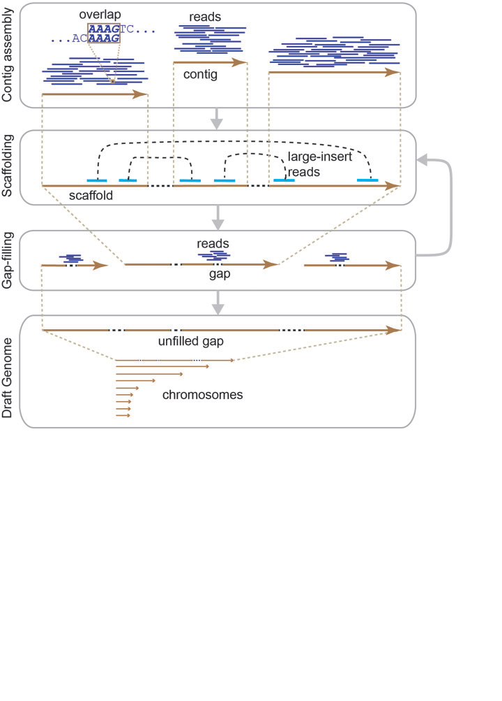
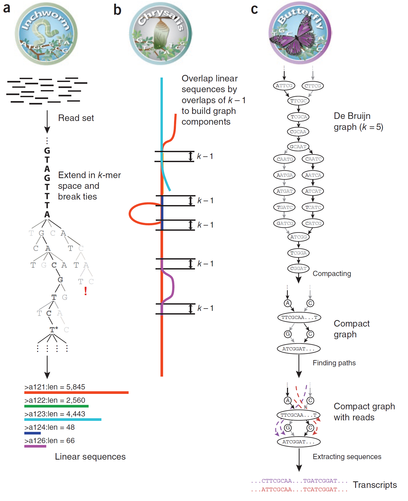

##INTRODUCCIÓN

El ensablado de novo para genomas y transcriptomas consiste en la conformación de secuencias coherentes a partir de los
datos del secuenciador cuando no existe un genoma de referencia con el cual comparar los datos de la secuenciación. 

En particular la secuenciación de genóma se centra en un estudio amplio del DNA en un organismo para conocer mutaciones, SNP´s, allelos, 
secuencias repetidas en tandem, genes, elementos nucleares, secuencias codificantes y no codificantes. Mientras que, el estudio de secuenciación de novo de transcriptooma 
se centra en el estudio dinámico de la expresión genómica cuantificable y también en el análisis de variantes, splicing y de algunas secuencias no codificantes.

Se debe tomar en cuenta El objetivo claro del estudio.
Tipo de medición (RNA-DNA).
Tipo de tecnología.
Tipo de factor o muestra.
Características de la muestra.


Coverage Equation
The Lander/Waterman equation is a method for computing coverage1.
The general equation is:
C = LN / G
• C stands for coverage
• G is the haploid genome length
• L is the read length
• N is the number of reads


##ENSAMBLADO 

Ensamblado de novo de genóma

Consiste en a) Designación del experimento y sobrelapamiento de reads y conformación-ensamblado de contings. b) generación de scafoldings. c) Rellenado de huecos entre scafolds. d) Generación de 
borradores parciales del genóma en cuestión.








Ensamblado de novo de transcriptoma

Este proceso consiste en  a) Designación experimental, generación de bibliotecas y secuenciación. b) análisis de control de calidad y filtrado de reads. c) Ensamblado de
novo mediante software como: velver, Oases, SPAdes, Trinity o BinPacker. Estos software generalmente utiliza para generar el ensablado los algoritmos o métodos:

OLC: Overlap-Layout-Consensus assembly
DBG: De Bruijn graph assembly

Para el ensamblado de transcriptoma de novo sin genoma de referencia existe una diversidad amplia en software:

Velvet/Oases (2008): Ambos software generan ensablado de novo de transcriptoma a partir de pair-end cortos. También, generan analisis de scplicing, sin embargo para realizar analisis adicionales, requieren de actualizaciones.

SPAdes (2012): este software genera ensamblado de novo en una amplia variedad de especies y tamaños de transcriptomas, además puede generar análisis de expresión.

Triniti: este softeare fué liberado en 2013 y los análisis de ensamblado son realizados mediante la utilización de 3 paquetes que se ejecutan de manera independiente. Ichworm, admite los reads del experimento de secuenciación en transcritos. Chrysalis, ensambla los transcritos y genera gráficas Buijin, mientras que Butterfly analiza los gráficos y genera transcritos completos.
Además triniti brinda  métricas de calidad de ensamblado y ensayos. En particular para transcritptoma exmina con la metrica de “exN50” (top de transcritos que representan el 50% del transcriptoma).

BinPacker ( 2016): este software contruye transcritos, incorpora información de la covertura y genera análisis de splicing. En específico este sistema profundiza en los análisis de splicing y su ensamblado.

Nota: Todos lo software anteriores utilizan entre sus herramientas, el algoritmo Bruijn Graph, que consiste en el traslape de reads para contruir transcritos o cadenas.





Ejemplo de triniti.

TRINITY
http://evomics.org/learning/genomics/trinity/
https://github.com/Jaiswal-lab/Transcriptome_Assembly_Scripts.git

```
Trinity --seqType fq --left <left_reads> --right <right_reads> --output test-trinity-cotton 
## where --seqType is read type "fq" fastq or "fa" fasta
## where --left is name and location of left reads
## where --right is name and location of right reads
## where --output is the name and location output
```
Ejemplo: Basic Trinity usage is as follows:

`
Trinity.pl --seqType (fq for fastq or fa for fast) --left ~/path/to/reads_1.fq --right ~/path/to/reads_2.fq (or --single for single reads) --CPU 4 --bflyHeapSpace 10G --output ~/path/to/output_dir
`
NOTE: It is recommended to use fully specified paths for sequence files with Trinity.


##EVALUACIÓN DE ENSAMBLADO

El análisis posterior es la evaluación del ensablado donde se analizan métricas como N50 o exN50.

softwares:
BLAST
rnaQUAST
Transrate
CD-HIT-EST


##PERSPECTIVAS

Disminición en la tasa de errores (Pacbio).
Dsitinguir contaminación.
disminución de costo para un mayor estudio de organismos específicos.


##cuestionario

1.¿Cuáles son las principales variantes del método de laboratorio para generar mis datos y cuándo es más útil cada una?

Para genoma de novo y transcriptomas las principales variantes del experimento de secuenciación es la generación de reads Pair-ends y Single-ends. Los reads Pair-ends es una estrategia  que conserva información de ambos sentidos de un transcrito, y se recomienda en uns secuenciación cuando no existe genóma de referencia.
 Por otro lado, la estratégia de Singel-end brinda una relación costo-efectiva y se recomienda en la secuenciación donde existe genoma de refeencia o bien genomas de organismos emparentados.
Existen otros factores que varian en el estudio de rna-seq de novo, número de replicados biológicos no menor a 3 y la inclusión de controles. Asi como el uso de ontologías específicas.

2.¿Qué limitantes y posibles fuentes de error puede presentar este método (en el laboratorio o la bioinformática)? ¿Qué puede hacerse para amortiguarlos?
 
Bioinformática:En el caso de genoma de novo y transcriptoma el número de reads aumenta para mayor exactitud de la secuenciación. Aunque el aumento de reads pair-end conllevan a una demanda de alamcenamiento bioinformático mayor.Por otro lado, la ausencia de muestras control limitan un análisis de contraste de expresión. Solución, contar con repositorios e infraestructura adecuada.
Laboratorio: Muestras con rna de poca calidad debido a la naturaleza del tejido. Solución, mejorar el proceso d extracción de rna ya que eso genera un aumento de falsos positivos y perdida de información.  


3.¿El muestreo requiere algún diseño específico? Por ejemplo, si se quiere secuenciar un genoma de novo ¿qué individuo sería ideal?

Si trabajo con trascriptomas, ¿cómo afecta el tejido, la edad, las condiciones, etc. mi muestreo?
El individuo o individuos ideales serian aquellos que representen un una linea genómica más conservada; es decir: que pertenesca a un grupo más ancestral. Lo cual puede generar datos de referencia genómica para estudios futuros com SNP´s o mutaciónes de diferentes tipos.
El transcriptomá es el conjunto de diferentes tipos funcionales de moléculas de RNA. Generalmente se asocia el RNA con la expreaión genómica por que es una transcripción del DNA en una célula. Ya que la transcripción se modula por diferentes formas asi también el transcriptoma, es decir; el transcriptoma de una célula se puede moduar en lapsos relativamente cortos de tiempo (minutos, horas, días). Por tla motivo el transcriptoma es altamente dinámico y es diferente en cada tipo celular. A sí mismo, el momento celular o momento metabólico va a influir en transcriptoma.
Dada la dinámica de cambio del transcriptoma, una estratégia de preservación del RNA durante una toma de muestra, es la congelación inmediata de la muestra, para preservar el transcriptoma en dicho momento.
4.Menciona al menos dos softwares principales que se utilicen para realizar la parte medular de los análisis bioinformáticos de este tipo de análisis (e.g. si es ensamblado de novo con qué se ensambla, no con qué se hace el pre-procesamiento) y cuáles son los pros y contras de cada uno.
Para el ensamblado de transcriptoma de novo sin genoma de referencia existe una diversidad amplia en software. 

Velvet/Oases (2008): Ambos software generan ensablado de novo de transcriptoma a partir de pair-end cortos. También, generan analisis de scplicing, sin embargo para realizar analisis adicionales, requieren de actualizaciones.

SPAdes (2012): este software genera ensamblado de novo en una amplia variedad de especies y tamaños de transcriptomas, además puede generar análisis de expresión.

Triniti: este softeare fué liberado en 2013 y los análisis de ensamblado son realizados mediante la utilización de 3 paquetes que se ejecutan de manera independiente. Ichworm, admite los reads del experimento de secuenciación en transcritos. Chrysalis, ensambla los transcritos y genera gráficas Buijin, mientras que Butterfly analiza los gráficos y genera transcritos completos.
Además triniti brinda  métricas de calidad de ensamblado y ensayos. En particular para transcritptoma exmina con la metrica de “exN50” (top de transcritos que representan el 50% del transcriptoma).

BinPacker ( 2016): este software contruye transcritos, incorpora información de la covertura y genera análisis de splicing. En específico este sistema profundiza en los análisis de splicing y su ensamblado.
Nota: Todos lo software anteriores utilizan entre sus herramientas, el algoritmo Bruijn Graph, que consiste en el traslape de reads para contruir transcritos o cadenas.
